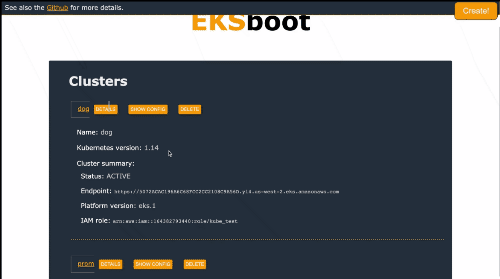

= EKSboot


EKSboot allows you a simple interface to quickly create, and bootstrap EKS clusters with common cluster addons. It also gives you a simple interface to delete, and soon update existing clusters.


> This is a service for development and test environments.
> It is not an official AWS offering, use at your own risk.



== Prerequisites

To get started you will need

- Docker
- Docker-Compose
- S3 bucket to store configs
- IAM role with EKS access

== Getting Started

Edit the .env file with an existing S3bucket, region to use

```
AWS_DEFAULT_REGION=us-west-2
EKSBOOT_URL=http://flask:80
EKSBOOT_BUCKET=aoisoifjsdiojefdsr
```

```
docker-compose up --build
```

navitgate to http://localhost:8080 to access the UI
navigate to http://localhost:80 to view the backend swagger definition

=== How does the API launch the infrastructure?


When you run a create command the API creates a json config file, with instructions about how to launch the Cluster.
Python then uses jinja to template out the buildspec.yml and cluster.yaml used by EKSctl and Codebuild for bootstrapping.
The flask api utilizes the AWS CDK to create a codepipeline with 2 steps
1. Source the S3 bucket to find the json config
2. Run codebuild EKSctl to create the cluster according to configuration provided
3. Run install scripts for addons selected


